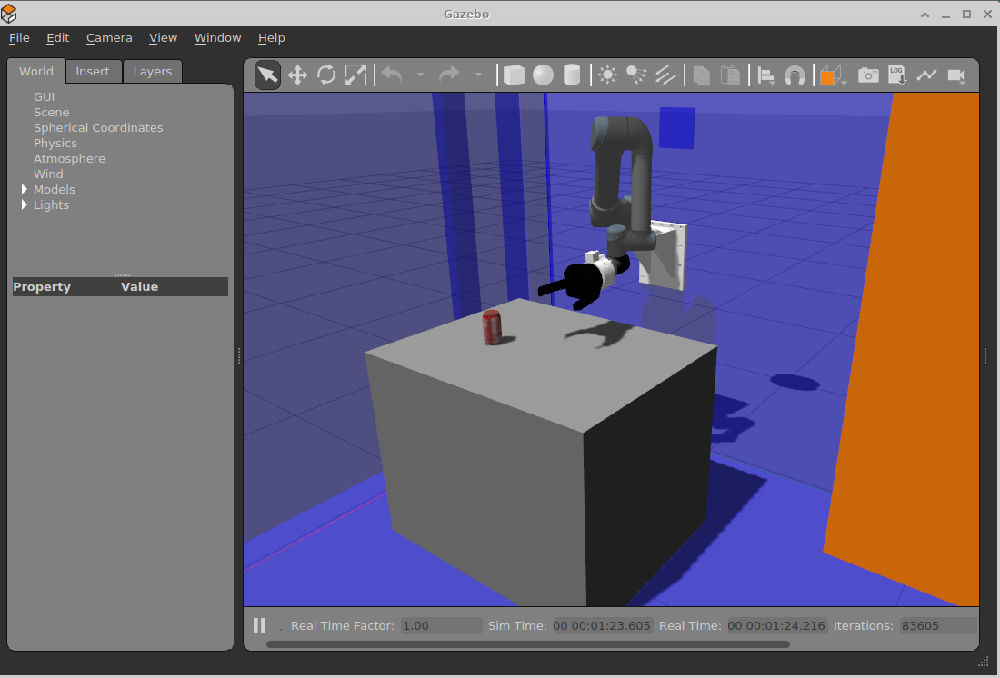

# tams_ur5_gazebo
Gazebo launch files and simulation specific data

## Installation 

Create a new ROS workspace and then download all ROS packages
required for the TAMS UR5 robot setup;
see <code>github.com/TAMS-Group/rosinstalls</code> for a list of
predefined rosinstall-scripts. In particular, you will require:

- the basic <code>ROS</code> system, 
- the <code>UR5</code> robot model from Universal Robots,
- the <code>Robotiq 3-finger gripper</code> robot model (tams fork),
- the <code>tams_ur5_setup</code> robot model and utilities,
- the <code>tams_ur5_gazebo</code> wrappers and tools for Gazebo.
- you also want <code>Moveit</code> with all its dependencies.

We currently support Gazebo classic (version 11.11.0 (c) 2012 OSRF)
on ROS noetic. Older and newer versions will not work and require
significant porting effort to run.

After downloading all required packages and their dependencies,
build your workspace (<code>catkin build</code>) and finally source 
your <code>devel/setup.bash</code> script from the freshly built
workspace.

## Usage

By default, the Gazebo simulator will be started in <code>paused</code>
with a timestep of 1.0 msec (or 1kHz udpate rate). You should update
the timestep according to your needs; shorter timesteps often result
in more accurate and more stable simlation, but not always. 

Typically, you would wait until your model is loaded into Gazebo; 
Click the <code>start</code> in the Gazebo GUI or run the corresponding 
Gazebo service (<code>gazebo/unpause_physics</code>).
Watch out for errors and try to fix all errors reported by Gazebo and rviz
before trying to fine-tune the simulation:

```
roscore &
roslaunch tams_ur5_gazebo tams_ur5_gazebo.launch
```

The world should now look similar to the screenshot:




## Example

For a first basic pick-and-place task with hardcoded configurations,
make sure to download the "Coke can" SDF model from the Gazebo models
collection. Install the TAMS UR5 setup files are described above.

```
roslaunch tams_ur5_gazebo tams_ur5_gazebo.launch
... wait until Gazebo has finished loading...
... press the start button

rosrun tams_ur5_gazebo grab_coke_can_demo.py 
... the scripts spawns one Coke can object, then moves the UR5 arm
    to grasp the can, lift it up, move a few centimeters, and drop
    back onto th e experiment table.
... to restart the demo, use world->models->coke can->delete in gzgui.
``` 
